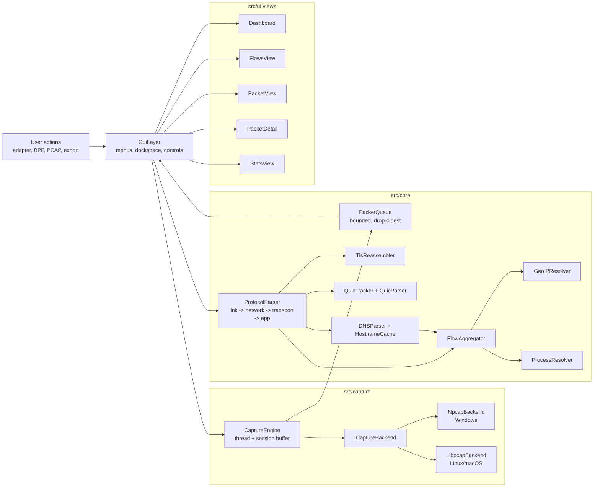
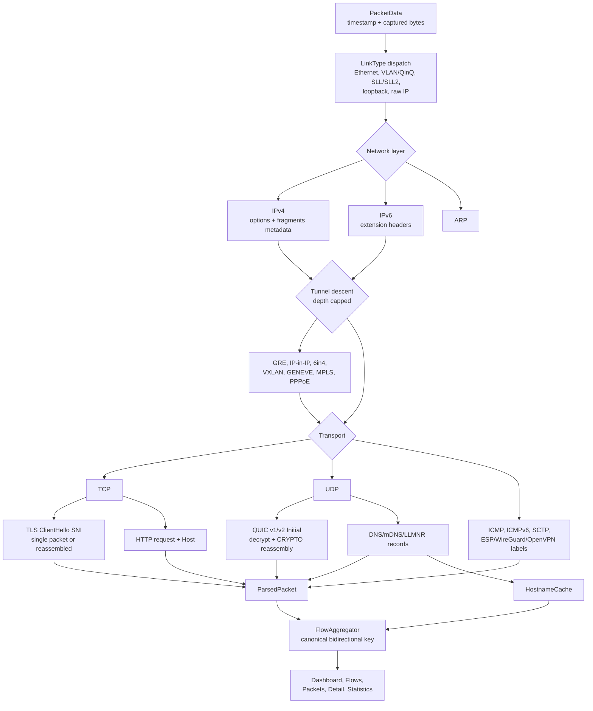
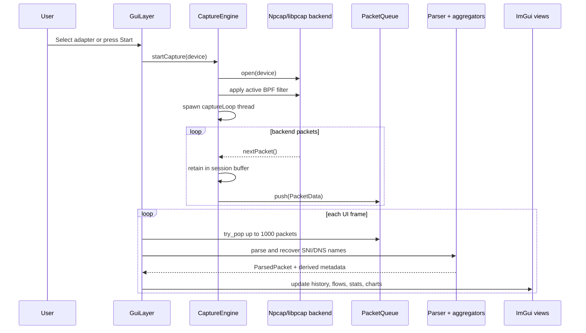
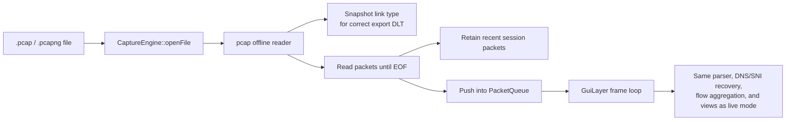

# NetProbe

A real-time and offline network traffic analyzer built with **Modern C++20**, **Npcap/libpcap**, and **Dear ImGui**.

  

## Download

Download the ZIP for your platform from [GitHub Releases](https://github.com/YehiaGewily/netprobe-cpp/releases). Windows releases require the [Npcap driver](https://npcap.com/#download) for live capture and PCAP support. Linux and macOS releases require their system libpcap runtime.

## Features

- **Live and offline capture**: inspect an active adapter or drag a `.pcap` / `.pcapng` into the app (classic libpcap and modern PCAPNG both supported).
- **Link-layer aware**: decodes Ethernet, VLAN/QinQ, Linux cooked captures (`SLL`/`SLL2`, as produced by the `any` device), BSD/OpenBSD loopback, and raw-IP captures. Exported PCAPs preserve the original link type.
- **Protocol insight**: IPv4/IPv6, TCP, UDP, ARP, ICMP/ICMPv6, SCTP, and named non-IP frames (LLDP, EAPOL, PPPoE, MPLS).
- **Tunnel descent**: transparently decodes **GRE, IP-in-IP, 6in4, VXLAN, GENEVE, MPLS, and PPPoE**, so flows are keyed on the real inner endpoints rather than the tunnel. Encrypted tunnels (ESP/IPsec, WireGuard, OpenVPN) are labelled as such instead of being silently misreported.
- **Deep application identification**:
  - **TLS SNI on any port** (content-sniffed, not port-gated), with **reassembly of ClientHellos split across TCP segments** — required now that post-quantum key shares push the message past one MSS.
  - **QUIC ClientHello SNI** for **v1 (RFC 9000) and v2 (RFC 9369)** on any UDP port, decrypting Initial packets and **reassembling CRYPTO frames across multiple Initials**.
  - **Cleartext HTTP**: request line and `Host:` header, which names hosts even when no DNS was observed.
  - **DNS/mDNS**: A/AAAA/CNAME, plus **PTR** (names LAN devices that never appear in a forward lookup), SRV, TXT, and **HTTPS/SVCB** records.
- **Encrypted-DNS visibility**: detects DoH/DoT/DoQ and **Encrypted Client Hello**, and tells you when name resolution has moved off the wire rather than silently showing bare IPs.
- **Packet detail pane**: click any packet to see a structured Frame → Tunnel → Network → Transport → Application decode plus an `xxd`-style hex dump of the raw bytes.
- **Flows view**: sortable per-connection byte totals, one-second rate, **initial TCP RTT** (from the SYN / SYN-ACK delta, color-coded by latency), duration, service, hostname, Country, and ASN/organization, with a detail pane and live rate sparkline. Flow keys are canonical, so both directions of a peer-to-peer conversation collapse into a single row.
- **Statistics view**: protocol hierarchy, top talkers by bytes, and name-resolution health.
- **Process resolution**: the *App* column shows the owning process on Windows (iphlpapi), Linux (`/proc/net/*` + `/proc/<pid>/fd/`), and macOS (`proc_pidfdinfo`).
- **Filtering and export**: live BPF capture filters such as `tcp port 443`, a separate display filter over captured packets, PCAP export, and flow export to CSV.
- **Light and dark themes**, adjustable UI scale, and keyboard shortcuts — all persisted between runs.
- **Cross-platform backends**: Npcap on Windows and libpcap on Linux/macOS.

| Live packet analysis | Connection flows | Offline PCAP mode |
| --- | --- | --- |
| Protocol, hostname, and per-packet hex | Rate, service, GeoIP, and ASN | No administrator rights required |

## Tech Stack

- **Language**: C++20
- **Packet Capture**: [Npcap SDK](https://npcap.com/) (Windows) / libpcap (Linux/macOS)
- **UI Framework**: [Dear ImGui](https://github.com/ocornut/imgui) + [GLFW](https://www.glfw.org/) with docking
- **Plotting**: [ImPlot](https://github.com/epezent/implot)
- **Crypto** (QUIC Initial decryption): [Mbed TLS](https://github.com/Mbed-TLS/mbedtls) — HKDF-SHA256, AES-128-ECB, AES-128-GCM
- **GeoIP/ASN**: [libmaxminddb](https://github.com/maxmind/libmaxminddb)
- **File dialogs**: [Native File Dialog Extended](https://github.com/btzy/nativefiledialog-extended)
- **Build System**: CMake (all third-party deps pinned via `FetchContent`)
- **Tests / fuzzing**: GoogleTest + libFuzzer harness on `ProtocolParser` and `DNSParser`


## Prerequisites

NetProbe uses Npcap on Windows and libpcap on Linux/macOS.

- **Windows 10/11**: Visual Studio 2022 with C++ Desktop Development, the [Npcap driver](https://npcap.com/#download), and the Npcap SDK extracted to `C:\Npcap-SDK` (`Include` and `Lib` directly inside).
- **Ubuntu/Debian**: `sudo apt install build-essential cmake libpcap-dev libgl1-mesa-dev libgtk-3-dev pkg-config`
- **macOS**: Xcode Command Line Tools and CMake. libpcap and OpenGL are provided by macOS; Native File Dialog uses Cocoa.

## Build Instructions

```powershell
# 1. Clone the repository
git clone https://github.com/YehiaGewily/netprobe-cpp.git
cd netprobe-cpp

# 2. Build via Script (Recommended)
.\build_project.bat
```

On Linux or macOS:

```bash
cmake -S . -B build -DCMAKE_BUILD_TYPE=Release
cmake --build build --parallel
ctest --test-dir build --output-on-failure
```

To create the same ZIP layout used by Releases:

```bash
cpack --config build/CPackConfig.cmake -C Release -G ZIP -B package
```

### Optional CMake flags

| Flag | Default | What it does |
| --- | --- | --- |
| `-DBUILD_TESTING=ON` | `ON` when top-level | Build the GoogleTest suite (`NetProbeTests`). |
| `-DENABLE_SANITIZERS=ON` | `OFF` | Build with `-fsanitize=address,undefined` (Clang/GCC only). |
| `-DBUILD_FUZZERS=ON` | `OFF` | Build the libFuzzer harness for the protocol parsers. Requires `clang` / `clang-cl`. |

## Usage

1. Run the executable from the extracted release ZIP or build output directory.
2. **No admin? Try the sample first.** The build emits `data/sample.pcap` (mixed ARP / DNS / TLS-SNI traffic with three resolvable hostnames). Open it via **File → Open PCAP…** to exercise the full UI without elevation.
3. **Live capture** usually requires elevated privileges. On Windows:

    ```powershell
    Start-Process ".\build\Release\NetProbe.exe" -Verb RunAs
    ```

4. Select a live adapter in the menu bar, or choose **File → Open PCAP…** / drop a PCAP file onto the window.
5. Use **Flows** for per-connection activity, or enter a BPF filter such as `tcp port 443` in the menu bar.
6. **Click a packet row** in *Live Packets* to populate the *Packet Detail* pane with the layered decode and hex dump.

For GeoIP and ASN columns, place `GeoLite2-Country.mmdb` and `GeoLite2-ASN.mmdb` in `data/`. See [data/README.md](data/README.md).

## Architecture

NetProbe is built around a bounded **producer-consumer** pipeline. Capture runs on a backend-owned path, while the Dear ImGui frame loop drains packets, enriches them, and updates view models without blocking the capture thread.

**Figure 1: Runtime Component Map**



**Figure 2: Packet Decode And Enrichment Pipeline**



**Figure 3: Live Capture Control Flow**



**Figure 4: Offline PCAP Path**



### Main Modules

- **Capture backend (`src/capture/`)**: `ICaptureBackend` hides the Npcap and libpcap implementations. `CaptureEngine` owns the backend, live capture thread, BPF application, offline reads, and a capped session buffer for PCAP export.
- **Packet queue (`src/core/PacketQueue.hpp`)**: thread-safe bounded queue (`std::mutex` + `std::condition_variable`). On overflow it drops the oldest packets so the UI stays close to live traffic; the dropped count is surfaced in the control bar.
- **Protocol stack (`src/core/`)**:
  - `LinkType` maps libpcap `DLT_*` values to supported encapsulations, so cooked, loopback, raw-IP, and Ethernet-family captures are decoded intentionally.
  - `ProtocolParser` is the stateless fast path: link layer -> IPv4/IPv6 -> tunnel descent -> transport -> application hints and service classification.
  - `TlsReassembler` buffers split TCP ClientHellos with size and expiry caps; it is owned by the UI layer because it is stream state.
  - `QuicParser` decrypts QUIC v1/v2 Initial packets with mbedTLS and extracts TLS ClientHello data from CRYPTO frames.
  - `QuicTracker` stitches CRYPTO fragments across multiple Initial packets, keyed by connection id.
  - `DNSParser` extracts DNS/mDNS/LLMNR answers, feeds `HostnameCache`, and flags advertised ECH configs.
  - `FlowAggregator` collapses both directions of a conversation into one canonical key, tracks rates and byte totals, and measures initial TCP RTT from SYN/SYN-ACK timing.
  - `GeoIPResolver` and `ProcessResolver` add country/ASN and process ownership where platform data is available.
- **GUI layer (`src/ui/`)**: `GuiLayer` owns the Dear ImGui dockspace, capture controls, settings, queue drain, stateful reassemblers, DNS name cache, flow aggregator, and bounded packet history. `Dashboard`, `FlowsView`, `PacketView`, `PacketDetail`, and `StatsView` render those derived models.

## Quality

- **60 unit and integration tests** (GoogleTest) covering protocol parsing, link-type handling, tunnel descent, TLS/QUIC ClientHello reassembly, HTTP header extraction, DNS record coverage, canonical flow keying, RTT measurement, queue concurrency, GeoIP lookup, QUIC Initial decryption end-to-end, and both classic-PCAP + PCAPNG fixtures — including an end-to-end test that drives a crafted capture file through the same pipeline the UI runs.
- **libFuzzer harness** on `ProtocolParser::parse`, `DNSParser::parseResponse`, and the stateful `TlsReassembler` / `QuicTracker`, across every supported link type, with a deterministic seed corpus. CI fuzzes every push for 60 seconds on Ubuntu + Clang and uploads any crash inputs as build artifacts.
- **AddressSanitizer + UndefinedBehaviorSanitizer** CI job runs the full test suite under ASan/UBSan on every push.
- **Three-platform CI matrix** (Windows / Ubuntu / macOS) builds the app, builds and runs the test suite, and packages release ZIPs via CPack on tag pushes. Windows test runs use a 7-Zip-extracted Npcap user-mode DLL so the kernel-driver install is unnecessary in CI.

## Contributing


Contributions are welcome! Please feel free to submit a Pull Request.

## License

This project is licensed under the MIT License.

